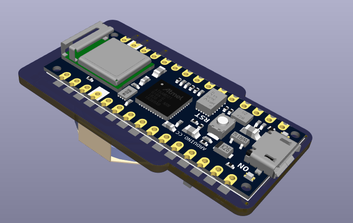
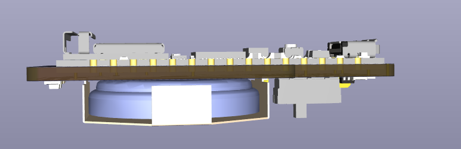
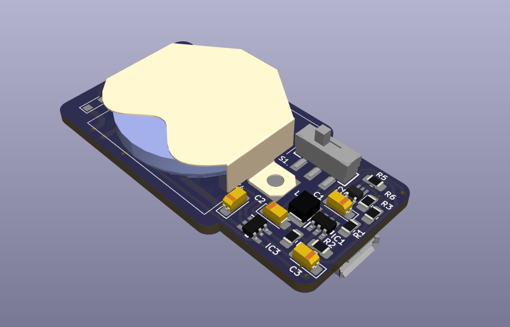
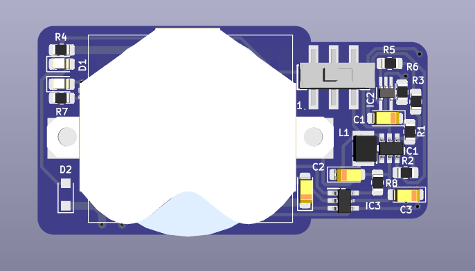

# Measurify Edge Meter

Edge Measurer is a board based on the [Arduino Nano BLE Sense](https://store.arduino.cc/products/nano-33-ble-sense-rev2?gclid=CjwKCAjwuqiiBhBtEiwATgvixP9YZH3kv_W2rU_MNzxRqpEtBDAPsVifqHgtA1YfRTseUCstFRrMhBoCzdEQAvD_BwE). The board is enhanced with a battery support as in the following figures:

EdgeMeter acquires values from sensors on the Arduino device and exposes the collected data using the on-board BLE connectivity. It provides IMU values (accelerometer, gyroscope and magnetometer), environmental values (proximity, temperature, humidity, pressure and ambient light) and orientation (heading, pitch, roll) as BLE characteristics. The sampling period can be decided by the connected client, the default value is 250 msec.

Two versions of arduino are supported: Change the name in the first line of the file edge-meter.ino as NANO_V1 for **Arduino Nano 33 BLE Sense** or NANO_V2 for **Arduino Nano 33 BLE Sense REV2**.

Folder node-client contains an example of client application developed in NodeJS.

Current version of BLE only allows a maximum of 20 bytes for each message. To send the array of IMU and ENV values we had to convert each value to 16-bit signed integer (int16_t). Sensor resolution is 16 bit so no information is lost. Values are multiplied to a coefficient described below.

The BLE local name is **Mesurify-Meter** and it exposes a single BLE service (UUID: 8e7c2dae-0000-4b0d-b516-f525649c49ca) featuring the following characteristics:

## Sampling Period Characteristic

- UUID: 8e7c2dae-0001-4b0d-b516-f525649c49ca
- Properties: read and write
- Data format: 16-bit unsigned integer
- Values: sampling period in msec

## IMU Characteristic

- UUID: 8e7c2dae-0002-4b0d-b516-f525649c49ca
- Properties: notify
- Original format: array of 9 float
- Data format: array of 9 signed int 16 bit
- Values: acceleration [G] * 8192 , angular velocity [dps] * 16.384 , and magnetic field [uT] * 81.92

## Environment Characteristic

- UUID: 8e7c2dae-0003-4b0d-b516-f525649c49ca
- Properties: notify
- Original format: 3 float and 5 int
- Data format: array of 8 signed int 16 bit
- Values: proximity [0 close, 255 far], temperature [C] * 100 , humidity [%] * 100 , pressure [kPA] * 100 , ambient light [0 dark] and color [RGB]

## Orientation Characteristic

- UUID: 8e7c2dae-0004-4b0d-b516-f525649c49ca
- Properties: notify
- Data format: array of 3 float
- Values: heading [degree], pitch [dpdegrees], and roll [degree]
